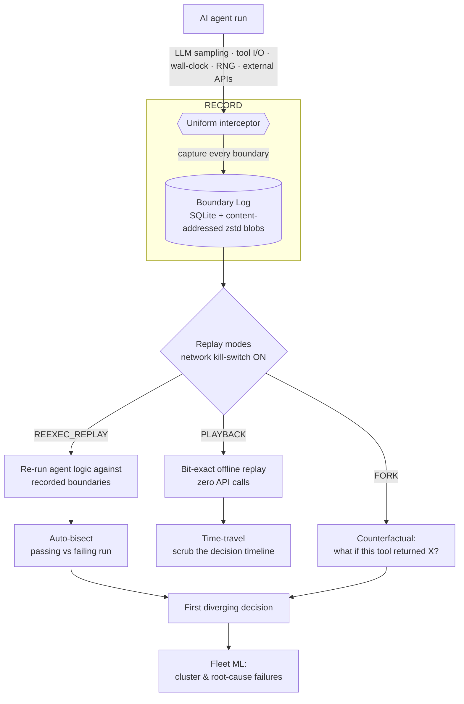

# Rewind

**A flight recorder & time-travel debugger for AI agents.**
_Record-replay (à la Mozilla `rr`) meets `git bisect` — Sentry/Datadog for AI-agent debugging._

[](https://github.com/namansh70747/rewind/actions)
[](./LICENSE)
[](https://www.python.org/)
[](#project-status)
[](https://github.com/astral-sh/ruff)
[](./CONTRIBUTING.md)

---

## Why this exists

AI agents are **nondeterministic**. Their behavior depends on LLM sampling, tool
and network I/O, wall-clock time, random number generators, and unpredictable
external APIs. When an agent misbehaves in production, that exact run is gone —
you cannot re-run it and get the same failure. Today's observability tools
(Langfuse, LangSmith, Arize) are passive trace **viewers**: they show you what
happened, but none of them can **re-execute** a run.

Rewind records every nondeterministic input an agent consumes during a run, then
lets you **replay that run bit-for-bit, fully offline, with zero API calls** —
and go further: scrub the decision timeline, fork counterfactuals, and
auto-bisect a passing run against a failing one to pinpoint the first decision
that diverged.

> The one-liner: **record-replay meets `git bisect` for AI agents.**

## Table of contents

<details>
<summary>Expand</summary>

- [Why this exists](#why-this-exists)
- [How it works](#how-it-works)
- [Features](#features)
- [Project status](#project-status)
- [Roadmap](#roadmap)
- [Tech stack](#tech-stack)
- [Repository layout](#repository-layout)
- [Quickstart](#quickstart)
- [Contributing](#contributing)
- [Security](#security)
- [License](#license)
- [Citation](#citation)
- [Acknowledgements](#acknowledgements)

</details>

## How it works

At the center of Rewind is a single **Boundary Log** and a **uniform
interceptor**. Every point where an agent touches nondeterminism — an LLM
completion, a tool call, a clock read, an RNG draw, an external API response — is
a *boundary*. The interceptor sits on all of these boundaries and runs in one of
four modes: **RECORD** (capture every boundary as it happens), **PLAYBACK**
(serve recorded values back, bit-exact and fully offline), **REEXEC_REPLAY**
(re-run the agent's own logic while feeding it recorded boundary values), and
**FORK** (replay up to a chosen point, then substitute a *different* boundary
value to explore a counterfactual). A **network kill-switch** is engaged during
any replay so that no live call can leak in and silently corrupt the result —
this is what makes replay *faithful* rather than merely *approximate*. Because
the log is content-addressed and self-contained, a recording is a portable,
reproducible artifact you can share, diff, and bisect.



## Features

- **Bit-exact replay, fully offline** — replay a recorded run with **zero API
  calls**. A network kill-switch guarantees no live traffic contaminates the
  result.
- **Time-travel debugging** — scrub forward and backward through the agent's
  decision timeline and inspect state at any boundary.
- **Counterfactual forks** — ask *"what if this tool had returned X?"*: replay up
  to a point, substitute a boundary value, and let the run continue from there.
- **Auto-bisect** — given a passing run and a failing run, automatically narrow
  down to the **first diverging decision** (`git bisect` for agent behavior).
- **Fleet failure intelligence** — cluster and root-cause failures across many
  runs with ML (embeddings + HDBSCAN), with a LoRA "failure-explainer" model
  planned.

## Project status

> [!IMPORTANT]
> **Rewind is pre-alpha and not yet usable.**
> The design is complete and this repository currently contains **scaffolding
> and design documentation only** — there is no working implementation yet.
> Implementation is just beginning (Phase 0). APIs, CLI, storage formats, and
> everything else are expected to change. Do not depend on Rewind for anything
> real yet. The most valuable contributions right now are **design feedback and
> ADR proposals** — see [Contributing](#contributing).

## Roadmap

Each phase ends with a working end-to-end slice. Details in
[`docs/roadmap.md`](./docs/roadmap.md).

- **P0 — Walking skeleton:** `record → replay → verify` CLI.
- **P1 — Faithful recorder:** complete boundary capture + web timeline.
- **P2 — Time-travel + fork:** timeline scrubbing and counterfactual forks.
- **P3 — Auto-bisect:** pass-vs-fail bisection to the first diverging decision.
- **P4 — Fleet + ML:** MCP fleet adapter + ML failure clustering / root-cause.
- **P5 — LoRA explainer + hardening:** fine-tuned failure-explainer, stabilization.

## Tech stack

- **Language:** Python 3.11+ (tested on 3.11, 3.12, 3.13).
- **Tooling:** `uv`, `ruff`, `mypy`, `pytest`, `pre-commit`.
- **Storage:** SQLite + content-addressed `zstd` blobs, DuckDB (analytics),
  LanceDB (vectors).
- **ML:** scikit-learn, embeddings, HDBSCAN; a LoRA failure-explainer later.
- **Standards:** vendor-neutral core built on **OpenTelemetry GenAI**
  conventions, with a first-class adapter for the author's MCP agent fleet
  (57 servers / 672 tools / 10-provider LLM router).
- **Footprint:** free / open source, laptop-first, zero-server.

## Repository layout

```text
rewind/
├── README.md               # you are here
├── LICENSE                 # Apache-2.0
├── CONTRIBUTING.md         # dev setup, workflow, ADR process
├── CODE_OF_CONDUCT.md      # Contributor Covenant v2.1
├── SECURITY.md             # vulnerability reporting + data-handling notes
├── CHANGELOG.md            # Keep a Changelog / SemVer
├── GOVERNANCE.md           # roles and decision-making
├── CITATION.cff            # how to cite Rewind
├── .gitignore
├── .gitattributes
├── pyproject.toml          # packaging + tool config
├── .github/                # CI workflows, issue/PR templates
│   └── workflows/
├── src/
│   └── flightrecorder/     # the import package (CLI: `fr`)
├── tests/
└── docs/
    ├── roadmap.md
    └── adr/                # architecture decision records
```

## Quickstart

> [!WARNING]
> 🚧 **Planned — not yet implemented.** The commands below describe the intended
> developer experience. Nothing here works yet; this section documents the target
> UX so the design can be reviewed.

Install (coming soon — distributed on PyPI as `rewind`):

```console
$ pip install rewind      # 🚧 not yet published
```

The intended CLI (`fr`):

```console
# Record an agent run into a portable, self-contained recording
$ fr record -- python my_agent.py

# Inspect a recorded run and scrub its decision timeline
$ fr show <run>

# Replay bit-exact and offline, then verify it matches the original
$ fr verify <run>

# Fork a counterfactual: replay to boundary N, then change what happens next
$ fr fork <run> --at N

# Bisect a passing run against a failing one to the first diverging decision
$ fr bisect <pass> <fail>
```

## Contributing

Contributions are welcome. Since Rewind is pre-alpha, the highest-impact
contributions today are **design feedback** and **ADR proposals**. See
[`CONTRIBUTING.md`](./CONTRIBUTING.md) for local setup with `uv`, linting,
typing, tests, branch/commit conventions, and the ADR process. All participation
is governed by our [Code of Conduct](./CODE_OF_CONDUCT.md).

## Security

Rewind records agent traces that may contain **secrets and PII**. Please read
[`SECURITY.md`](./SECURITY.md) for how to report vulnerabilities privately, our
redaction-on-export commitments, and why you should **never commit recordings**
to a repository.

## License

Rewind is licensed under the **Apache License 2.0**. See [`LICENSE`](./LICENSE).

## Citation

If you use Rewind in academic work, please cite it — see
[`CITATION.cff`](./CITATION.cff).

## Acknowledgements

Rewind stands on the shoulders of prior art. It is directly inspired by
[Mozilla `rr`](https://rr-project.org/) and the record-replay debugging
tradition, and it builds on the
[OpenTelemetry GenAI semantic conventions](https://opentelemetry.io/docs/specs/semconv/gen-ai/)
for a vendor-neutral core. Thanks to the broader AI-agent observability community
for framing the problem.
