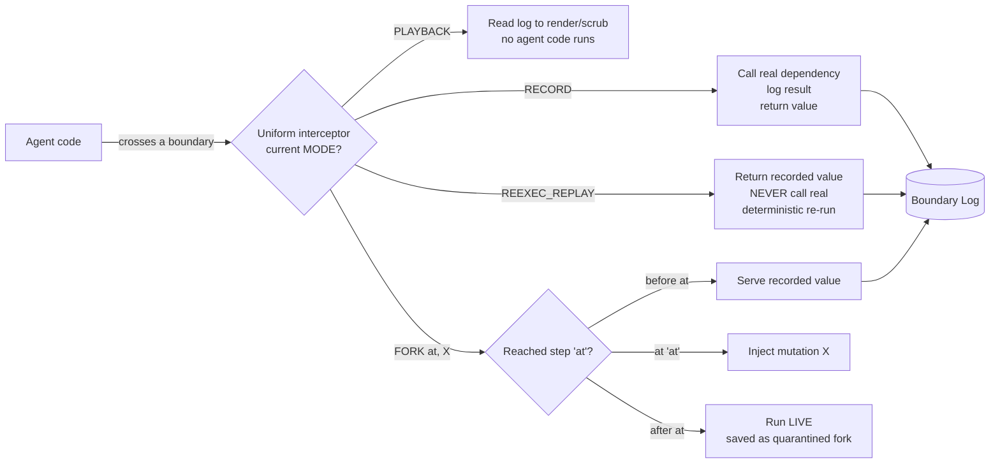
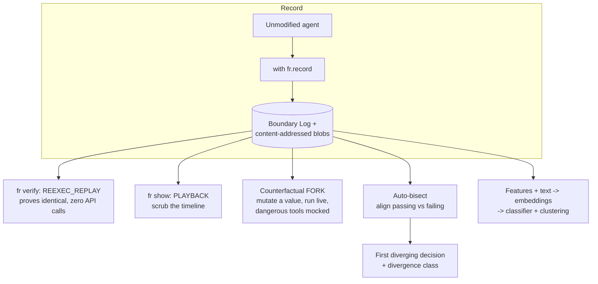
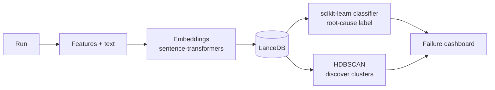

# Architecture

This page describes how Rewind is built. It assumes you have read the
[Design](design.md) narrative — the pure-function insight
(`outcome = agent_code(sequence_of_boundary_reads)`) is the premise everything below
rests on. Terms in **bold** are defined in the [Glossary](glossary.md).

---

## The spine: the Boundary Log

Everything in Rewind is organized around a single structure: the **Boundary Log**.

Every value an agent reads from the nondeterministic world crosses a **boundary** —
the seam between the agent's own deterministic code and everything external to it
(the LLM, tools, the clock, RNG, the environment, the network). Rewind mediates
*every* boundary with **one uniform interceptor**. The interceptor does not have
special cases per feature; it has a single **mode**, and the mode decides what happens
when a boundary is crossed.

### The four modes

| Mode | Calls the real world? | Runs agent code? | Purpose |
| --- | --- | --- | --- |
| **RECORD** | Yes | Yes | Call the real dependency, log the result, return it to the agent. |
| **PLAYBACK** | No | **No** | Read the log to render/scrub the timeline. No agent code executes. |
| **REEXEC_REPLAY** | **Never** | Yes | Return the recorded value; deterministically re-run the agent. |
| **FORK(at, X)** | Only after `at` | Yes | Replay to step `at`, inject mutation `X`, then continue **live**. |

Two of these are both called "replay" in casual conversation, and keeping them
distinct is essential to understanding the system:

- **Passive playback** (`PLAYBACK`) runs *no agent code at all*. It is for the UI:
  rendering the timeline, scrubbing back and forth. It just reads the log.
- **Active re-execution** (`REEXEC_REPLAY`) runs the *agent's own code* again, serving
  recorded values back at each boundary. This is what proves a run is reproducible and
  is the substrate for forking.

All modes are entered through one context manager. Recording an agent is as simple as:

```python
import flightrecorder as fr

with fr.record():
    result = run_my_agent(task)
```

### Mode flow



### End-to-end lifecycle



---

## Capture: what crosses the boundary

In `RECORD` mode the interceptor captures every category of nondeterministic read.
The rule is strict: **capture everything the agent reads from outside; capture nothing
of the agent's own deterministic computation.**

Captured boundaries include:

- **LLM calls** — the full request (model, params, seed, tools/function schemas) and
  the full response (`tool_calls`, `finish_reason`, token `usage`), the exact
  **streaming chunk sequence**, which provider a router selected, and that router's
  rate-limit state at the time.
- **Tool results** — every value returned by a tool the agent invoked.
- **Wall-clock time** — `now()`, timestamps, and timeout reference points.
- **RNG and identifiers** — `random`, `uuid`, `os.urandom`, and `PYTHONHASHSEED`.
- **Environment and config** — env vars and configuration the agent read.
- **Retrieval and DB reads** — vector search results, query results.
- **Generic HTTP** — a catch-all for any other outbound request.
- **Async completion order** — the order in which concurrent tasks finished.
- **External and human inputs** — anything a person or upstream system fed in.

Interception is achieved with **[wrapt](https://github.com/GrahamDumpleton/wrapt)**
function wrappers, decorators, and determinism shims (for the clock, RNG, and hash
seeding), all activated behind the `with fr.record():` context.

### Relationship to OpenTelemetry

Rewind uses the **OpenTelemetry GenAI semantic conventions** as its *structural and
index* layer. OTel spans give a standard, vendor-neutral description of the run's
causal structure, and — because the export is standard — you can view runs for free in
Jaeger, Tempo, or Perfetto without Rewind's own UI.

OTel is **not** the payload store. OTel content capture is opt-in and truncated, which
is fatal for faithful replay. So Rewind stores the **real payload bytes itself**,
**content-addressed**, alongside the OTel structure. OTel tells you the shape of the
run; Rewind's blob store holds the exact bytes needed to reproduce it.

---

## Replay and the seatbelt

`REEXEC_REPLAY` re-executes the agent's own code, serving recorded values at each
boundary. The hard part is **matching**: when the agent crosses a boundary during
replay, which recorded value should it receive?

Matching is **ordinal-primary and content-validated**:

1. **Ordinal key (primary):** `(thread, boundary type, call-site, occurrence #)`. The
   **occurrence index** is what makes loops and retries replay correctly — the third
   call to the same tool at the same call-site gets the third recorded value, not the
   first.
2. **Content validation:** the request hash is checked against the recorded request.
   If it disagrees, that is a **divergence** — and divergences are always surfaced,
   **never silently served**.

### The network kill-switch (the seatbelt)

The single biggest credibility risk for any record-replay system is
**silent unfaithful replay**: the replay quietly makes a real call, gets a
plausible-but-different value, and you trust a result that never actually happened.

Rewind's answer is a **network kill-switch**. During re-execution, **any** outbound
call that is *not* served from the recording **raises immediately**. This converts the
worst failure mode — a silent, wrong replay — into a **loud, located error** that
points at the exact boundary that went unmatched. Faithful replay is thus enforced,
not hoped for.

### Code drift

Because replay re-runs the *agent's own code*, that code can change between recording
and replay. Rewind captures a **code fingerprint** and offers three modes:

- **strict** — refuse to replay if the fingerprint differs.
- **lenient** — replay but flag the drift.
- **live-fallback** — for controlled cases, allow live calls where the code has moved.

---

## Time-travel and the counterfactual fork

### Scrubbing (passive)

Time-travel scrubbing uses `PLAYBACK`: the log is a totally-ordered sequence, so the
UI can render the run's state at any step and let you move forward and backward
without running any agent code.

### State reconstruction

To reconstruct the agent's *internal* state at step N (not just the boundary values),
Rewind combines **replay-to-N** (re-execute up to step N under `REEXEC_REPLAY`) with
**periodic snapshots** so long runs don't have to replay from zero every time.

### Counterfactual fork

A **fork** answers "what if this boundary had returned X?":

1. Replay to step N under `REEXEC_REPLAY`.
2. **Inject the mutation** X at step N.
3. **Switch to live continuation** — from N onward the agent runs for real against the
   new value.
4. The forked run is saved as a **quarantined** run, distinct from the original
   recording.

### The hard problem: non-idempotent side effects

Live continuation is dangerous because forward execution can re-trigger
**non-idempotent side effects** — re-send an email, re-charge a card. Rewind handles
this with a **side-effect policy engine**:

- Every tool is **classified** as read-only or mutating; the **default is mutating**
  (fail safe).
- In fork mode, mutating tools are **mocked by default** so no real side effect fires.
- A **human-gate** option can require explicit approval before a mutating tool runs
  live.
- A **per-tool sandbox hook** (for example, [urunc](https://github.com/nubificus/urunc))
  can run a mutating tool in isolation when real execution is genuinely required.

This is why, in the invoice-agent example from the [Design](design.md), you can fork a
run and watch corrected behaviour while `send_invoice` is safely mocked.

---

## Auto-bisect

Given a **passing** run and a **failing** run, auto-bisect finds the **first diverging
decision** between them.

1. **Sequence-align** the two runs with Needleman–Wunsch / DTW using a **semantic
   cost** function (not raw byte equality).
2. **Distinguish two kinds of divergence:**
   - **same-input → different-output** — the *decision itself* diverged. Fix by
     pinning the seed, lowering temperature, or switching provider.
   - **different-input → different-output** — the inputs already differed, so walk
     further back to find where.
3. **Classify** the divergence into a taxonomy:
   arg-hallucination, tool-choice, sampling-flake, tool-result-drift, retrieval-drift,
   loop, cost-blowup, truncation, api-error.

That classification is not just for humans — it doubles as a **weak label** feeding
the ML layer.

---

## Storage and data model

Rewind is **embedded and local-first** — no server to stand up (see
[ADR-0003](adr/0003-embedded-local-first-storage.md)):

| Store | Role |
| --- | --- |
| **SQLite** | Metadata and the **authoritative replay index** (the ordinal boundary keys). |
| **Content-addressed zstd blob store** | The real payload bytes, `zstd`-compressed, **deduplicated across runs** by content hash. |
| **DuckDB** | Analytics and aggregate queries over runs. |
| **LanceDB** | Vector store for embeddings used by the ML layer. |
| **OTLP export** | Emit spans to Jaeger / Tempo for free structural viewing. |

**PII handling:** payloads are captured **raw locally** but **redacted on export**. A
**structure-only mode** is available for environments that must never persist raw
content.

---

## The ML layer

Every recording is training data. The pipeline turns a run into intelligence about a
whole fleet:



- **Features + text → embeddings** with `sentence-transformers`, stored in **LanceDB**.
- **scikit-learn classifier** predicts a root-cause label; **HDBSCAN** discovers
  clusters of related failures; **UMAP** projects them for visualization.

The crucial trick is **free weak-supervision training data** — no manual labeling
required (see [ADR-0005](adr/0005-ml-classifier-now-lora-later.md)):

- **bisect divergence classes** (from auto-bisect above) as labels,
- **heuristic labeling functions**,
- **LLM-as-judge** using a local **Ollama** model,
- **synthetic failures** manufactured by the counterfactual fork.

A **LoRA "failure-explainer"** — a small local model fine-tuned to narrate a run's
root cause in plain English — is the final phase, deliberately deferred until the
classifier and vector store are proven.

---

## Where this maps to the plan

Each capability above is delivered by a specific phase in the [Roadmap](roadmap.md),
and the reasoning behind the big structural choices is recorded in the
[Architecture Decision Records](adr/README.md).
