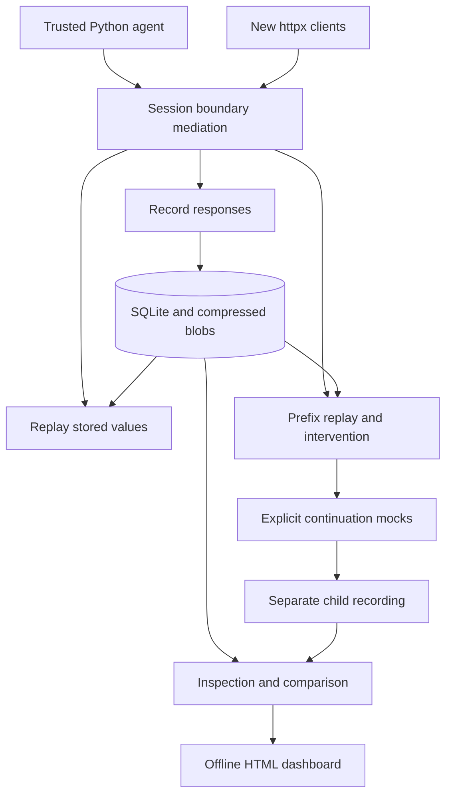

> This document describes the initial alpha. For subsequent storage, concurrency,
> integration and ML scope changes, see [the roadmap evidence ledger](roadmap-status.md)
> and [ADR 0010](adr/0010-roadmap-storage-and-scope.md). Those current records take precedence.

# Implemented architecture (0.1.0)

This page describes shipped code. Earlier design/ADR documents describe the wider
research direction and may specify components not present in this release.

## Data contracts

A `Boundary` contains contiguous zero-based `seq`, `kind`, `key`, JSON-compatible
request/response and `chain_hash`. A `Cassette` includes boundaries, final chain
fingerprint, final output, provider/model and optional metadata. Requests/responses
are copied so agent mutations cannot rewrite evidence.

`validate` checks each sequence/link and the final fingerprint. The chain algorithm
is BLAKE2b-256 over previous hash bytes and canonical JSON, compatible with the
existing repository recordings. It does not authenticate the recording author.

`RunStore.save` uses one SQLite transaction. Request/response values are deduplicated
by BLAKE2b content hash and compressed with zlib. `run_metadata` is an additive table
so existing stores remain readable. Portable JSON is `rewind.cassette.v1`, with a
SHA-256 checksum over the entire run including final output and lineage.

## Capture and replay

`capture` temporarily wraps new sync/async httpx clients including proxy mounts.
Serialized HTTP responses are buffered, sanitized and rebuilt. UTF-8 codepoints
split across chunks are decoded incrementally. Binary bodies are rejected rather
than silently decoded with replacement characters. Headers other than content type,
raw JSON spacing and network timing are not retained.

`replay_once` validates evidence, executes the supported Session callback with no
live transport, checks complete consumption and returns output plus fingerprint.
`verify` compares both to the recording. The lower-level `verify_run` only checks
boundary fingerprints; `verify_script` also compares sanitized stdout and source SHA.

The Python socket guard blocks common TCP/UDP/DNS escape routes while replay runs.
It is process-global, does not confine files/processes/native extensions and is not
safe for untrusted code. Capture/replay should run in an isolated application process.

## Fork policy

`ForkSession` reuses original responses before `at`. At the intervention it requires
the same input identity, records the replacement response and rehashes the suffix.
Every subsequent boundary must have a `(kind, key)` mock callback; original producers
are never called. The resulting cassette records `parent_fingerprint`, `fork_at`,
`counterfactual` and `continuation_policy`. Mock callbacks and agent code are trusted.

## Presentation layer

`state_at` exposes only the prefix and the latest explicit state event. The dashboard
embeds JSON in an escaped script data block, renders values with `textContent`, and
ships a CSP denying connections. It requires no web server, CDN or analytics endpoint.
Verification badges are evidence collected by Python at export time, not a live check
of the HTML. Regenerate the artifact to refresh data.

## Complexity

- Record/validate/replay: O(n + payload bytes); storage deduplicates payloads.
- First divergence: O(n), step-aligned; not yet a binary-search implementation.
- State inspection: O(n) prefix scan; no periodic heap checkpoint machinery.
- Similarity: sparse event-feature cosine; deterministic, no trained model.

## Future work

True concurrent capture/replay, richer redaction, request/response header policies,
error/retry recording, streaming backpressure, imported-module drift manifests,
sequence alignment, provider SDK qualification, OTel/MCP/LangGraph adapters and
fleet ML need separate design and evaluation. They are not prerequisites for the
implemented offline demo, and are not claimed as delivered.
